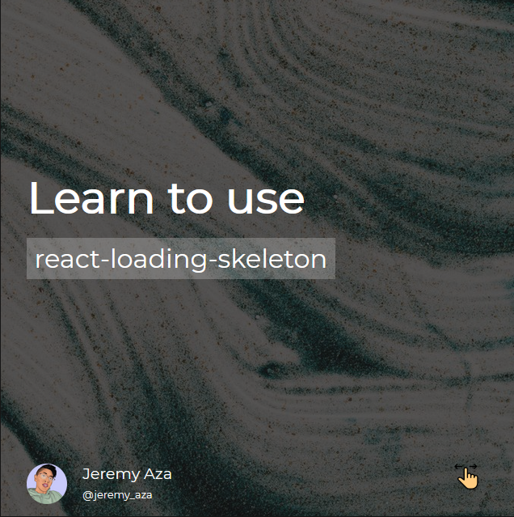

# Card loading skeleton

A simple example about the funcionality and implementatio about [react-loading-skeleton](https://github.com/dvtng/react-loading-skeleton)

## Challenge



## Live Application URL ✨

The Application is deployed in https://profile-card-jeremy.netlify.app/

Click on the link to see the web

## Cloning and Running the Application in local 🔮

Clone the project into local

Install all the npm packages. Go into the project folder and type the following command to install all npm packages

```bash
npm install
```

In order to run the application Type the following command

```bash
npm start
```
